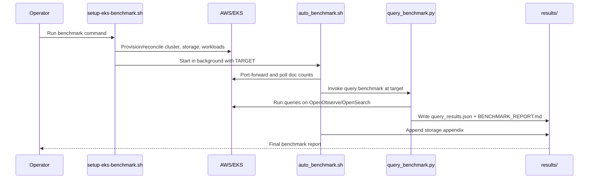

# Architecture

## Overview

This project benchmarks OpenObserve vs OpenSearch on AWS EKS using generated log traffic and post-ingestion query benchmarking.

End-to-end behavior is orchestrated by shell scripts and benchmark runners in this repository.

## Components

1. Operator entrypoints
- run-100m-eks-benchmark.sh
- setup-eks-benchmark.sh
- scripts/run-500m-benchmark.sh (advanced/phase flow)

2. Provisioning and deployment
- setup-eks-benchmark.sh
- deploy/aws/static-pv-pvc.yaml
- deploy/openobserve/*
- deploy/opensearch/*
- deploy/logstorm/*
- deploy/fluentbit/*

3. Data generation and ingestion
- app/logstorm (Go generator)
- Kubernetes workloads route generated logs to both platforms

4. Benchmark automation and analysis
- benchmark/auto_benchmark.sh
- benchmark/query_benchmark.py

5. Output artifacts
- results/BENCHMARK_REPORT.md
- results/query_results.json

## End-to-End Flow (User Action to Result)

1. User starts benchmark
- Runs run-100m-eks-benchmark.sh or setup-eks-benchmark.sh

2. Setup orchestration begins
- Validates required tools and AWS identity
- Creates/reuses EBS volumes
- Creates/reuses EKS cluster and nodegroup
- Installs/validates EBS CSI addon
- Builds and pushes LogStorm image to ECR

3. Workload deployment
- Applies PV/PVC and service manifests
- Deploys OpenObserve and OpenSearch stateful workloads
- Waits for pods to become ready
- Pre-configures OpenSearch index for ingestion profile

4. Automation handoff
- setup-eks-benchmark.sh launches benchmark/auto_benchmark.sh in background

5. Ingestion monitoring loop
- auto_benchmark.sh establishes local port-forwards
- Polls OpenObserve doc count until TARGET is reached
- Keeps port-forwards alive and restarts on failure

6. Query benchmark trigger
- On target hit, auto_benchmark.sh restores OpenSearch refresh interval
- Flushes OpenObserve
- Executes benchmark/query_benchmark.py

7. Query benchmark execution
- query_benchmark.py runs query suites on both backends
- Measures p50, p95, p99 per query
- Collects storage and memory context
- Writes JSON and Markdown report

8. Final report enrichment
- auto_benchmark.sh collects PVC disk usage
- Appends storage appendix to BENCHMARK_REPORT.md

9. Operator review
- Operator inspects results under results/

## Sequence Diagram

## Data and Control Boundaries

Control plane actions:
- setup-eks-benchmark.sh (cluster and deployment lifecycle)

Runtime control actions:
- auto_benchmark.sh (progress detection and trigger control)

Measurement logic:
- query_benchmark.py (latency/statistics/reporting)

## Failure and Recovery Model

1. Provisioning stage
- Script exits on tool or AWS failures (set -euo pipefail)
- Safe to re-run; cluster and nodegroup checks handle existing resources

2. Runtime stage
- auto_benchmark.sh restarts dead port-forwards automatically
- If query stage fails, rerun query_benchmark.py manually after port-forward recovery

## Operational Notes

- The benchmark is asynchronous after setup starts auto_benchmark.sh.
- Main operational logs:
- /tmp/o2-setup.log
- /tmp/auto-benchmark.log
- Resource cost continues until cluster is deleted.
